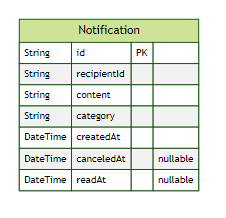

<h1 align="center">Notifications Microservice - Ignite Lab NodeJS</h1>

    <a href="./readme.pt.md" />Versão em Português</a>

 

    

🚀 In this repo you'll find a notifications microservice developed on the NodeJS edition of the Ignite Lab Event by <a href="https://www.rocketseat.com.br/" target="_blank">Rocketseat</a>.

 <a href="#status">Features</a> • 
 <a href="#running">Running</a> • 
 <a href="#contributing">Contributing</a> • 
 <a href="#license">Licence</a>

<h2 id="status"> ✅ Features</h2>
<ul>
    <li>SOLID architecture using NestJS;</li>
    <li>Create, Cancel, Read, Unread, Count and Get notifications;</li>
    <li>Prisma ORM Database integrations;</li>
    <li>Unit testing of the main features;</li>
    <li>Kafka;</li>
</ul>

<h2 id="running"> 🖥 Running</h2>
After instaling <a href="https://nodejs.org/en/">NodeJS</a>, you can clone this repository and run the following commands:
 
<pre>
    npm install
    npm run start:dev
</pre>

The Insomnia API Collection can be found at <a href="./insomnia.yaml">./insomnia.yaml</a>

To run this project with Kafka, you'll need to configure your Kafka environment variables in the .env file. The consumer expects the content, category and recipientID fields from the producer.
 
<h2 id="contributing">🤝 Contributing</h2>

Have you found a bug or do you have an interesting contribution to this project? Feel free to contribute!

<h2 id="licence">📘 Licence</h2>
<a href="https://choosealicense.com/licenses/unlicense/" target="_blank" />Unlicense</a>

